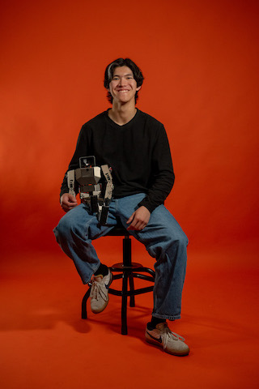

my name is michael, but most of my friends call me lutz (my last name). i'll be
a quant dev in nyc, and i work on deep learning projects in my free time.
graduated from berkeley eecs, during which i was a z-fellow and a member of
machine learning @ berkeley. previously built an rl robotic training framework
at k-scale labs (see [ksim](https://github.com/kscalelabs/ksim)).

i believe there's an algorithm out there that may create unbounded intelligence,
and i'd like to help find it.

